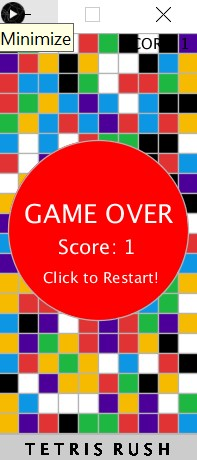

## Tetris-Rush-Game

### This is a game, similar to the famous Tetris game, that I made for my computer science class assignment.

Programming language used: __Python and Processing GUI__

Fun Fact: __Scored Full (100%)!__ 😉

__How to Play:__
- Use arrow keys (Right and Left) to navigate as the blocks fall down automatically.
- To score a point, 4 same color consecutive blocks should be placed vertically. 
  After it's accomplished, the 4 blocks vanish, score increments by 1 and the speed of the falling blocks reset.
- As the game progresses, the speed of the falling blocks increase.
- After all the game screen is filled completely, the game ends.
- The game can be restarted on mouse click anywhere inside the game screen.

Below are some screenshots of this game:

